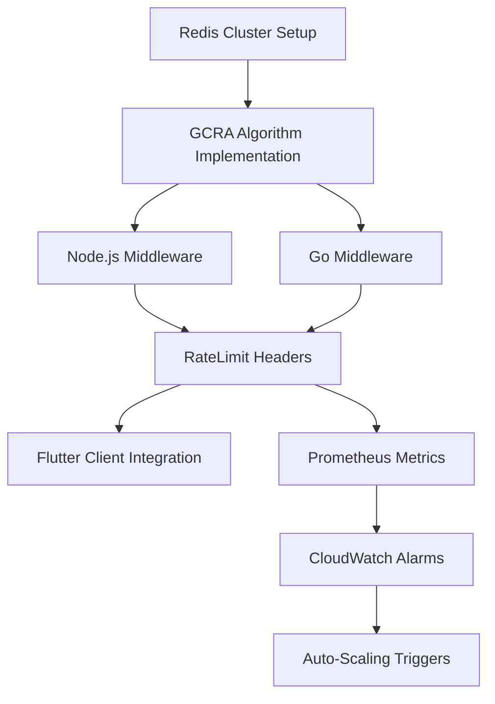

# FUTURE IMPROVEMENTS - HTTP RateLimit Headers with Linear Rate Limiting (GCRA)

> Reference: [IETF draft-ietf-httpapi-ratelimit-headers](https://datatracker.ietf.org/doc/draft-ietf-httpapi-ratelimit-headers/) | [GCRA Linear Rate Limiting](https://dotat.at/@/2026-01-13-http-ratelimit.html)

---

## 1. RateLimit Headers Implementation

### RateLimit-Policy Header

| Task | Priority | Effort | Status |
|------|----------|--------|--------|
| Implement `RateLimit-Policy` response header with `q` (quota) parameter as non-negative integer | P0 | S | ✅ TODO |
| Add `w` (window) parameter expressing time window in seconds | P0 | S | ✅ TODO |
| Implement `pk` (partition key) as Byte Sequence for client identification | P1 | M | ✅ TODO |
| Support `qu` (quota units) parameter with values: `requests`, `content-bytes`, `concurrent-requests` | P1 | M | ✅ TODO |

**Target Format:**
```http
RateLimit-Policy: "burst";q=100;w=60;qu="requests","daily";q=1000;w=86400
```

### RateLimit Header

| Task | Priority | Effort | Status |
|------|----------|--------|--------|
| Implement `RateLimit` response header with `r` (remaining quota units) as non-negative integer | P0 | S | ✅ TODO |
| Add `t` (time until reset) parameter in seconds | P0 | S | ✅ TODO |
| Include `pk` (partition key) matching the policy partition | P1 | S | ✅ TODO |
| Return consistent policy identifiers across response sequences | P1 | M | ✅ TODO |

**Target Format:**
```http
RateLimit: "burst";r=50;t=30
```

### Multi-Policy Support

| Task | Priority | Effort | Status |
|------|----------|--------|--------|
| Support List of Quota Policy Items in single `RateLimit-Policy` field | P1 | M | ✅ TODO |
| Implement selective policy reporting based on exhaustion proximity | P2 | M | ✅ TODO |
| Split policy items across multiple header fields per Structured Fields spec | P2 | S | ✅ TODO |
| Document policy precedence rules for overlapping quotas | P1 | S | ✅ TODO |

### Partition Key Generation Strategy

| Task | Priority | Effort | Status |
|------|----------|--------|--------|
| Define `pk` generation algorithm: `SHA256(user_id + endpoint_class)` | P0 | M | ✅ TODO |
| Document partition key algorithm in API docs for client prediction | P1 | S | ✅ TODO |
| Ensure `pk` derived only from request data (no server-side secrets) | P0 | S | ✅ TODO |
| Sanitize `pk` to exclude sensitive information (tokens, PII) | P0 | S | ✅ TODO |
| Implement endpoint-class partitioning: `auth`, `payment`, `catalog`, `general` | P1 | M | ✅ TODO |

---

## 2. Linear Rate Limiting (GCRA Algorithm)

### Per-Client Timestamp State Storage

| Task | Priority | Effort | Status |
|------|----------|--------|--------|
| Store per-client `time` (not-before timestamp) in Redis with key pattern `ratelimit:{pk}:time` | P0 | M | ✅ TODO |
| Implement MongoDB fallback for rate limit state with TTL index | P1 | M | ✅ TODO |
| Use Redis `GETSET` atomic operations for concurrent request handling | P0 | M | ✅ TODO |
| Configure state TTL equal to `window + buffer` (window * 1.5) | P1 | S | ✅ TODO |

**Redis Key Structure:**
```
ratelimit:{pk}:time -> float (Unix timestamp)
ratelimit:{pk}:policy -> string (policy identifier)
```

### GCRA Core Algorithm Implementation

| Task | Priority | Effort | Status |
|------|----------|--------|--------|
| Implement state retrieval: `time = state[pk] or 0` | P0 | S | ✅ TODO |
| Implement sliding window clamp: `time = clamp(now - window, time, now)` | P0 | M | ✅ TODO |
| Implement cost consumption: `time += interval * cost` where `interval = window / quota` | P0 | M | ✅ TODO |
| Calculate rate constant: `rate = quota / window` | P0 | S | ✅ TODO |

**GCRA Pseudocode Reference:**
```javascript
// Retrieve state
let time = await redis.get(`ratelimit:${pk}:time`) || 0;

// Clamp to sliding window
time = Math.max(now - window, Math.min(time, now));

// Consume request cost
const interval = window / quota;
time += interval * cost;

// Store updated state
await redis.setex(`ratelimit:${pk}:time`, window * 1.5, time);
```

### r/t Computation Logic

| Task | Priority | Effort | Status |
|------|----------|--------|--------|
| Implement ALLOW branch: `d = now - time`, `r = floor(d * rate)`, `t = ceil(d)` | P0 | M | ✅ TODO |
| Implement DENY branch: `r = 0`, `t = ceil(time - now)` | P0 | M | ✅ TODO |
| Round quota down, window up for conservative client estimates | P1 | S | ✅ TODO |
| Handle `qu="content-bytes"`: set `cost = response.byteLength` | P1 | M | ✅ TODO |

**Computation Reference:**
```javascript
if (now > time) {
  const d = now - time;
  const r = Math.floor(d * rate);  // remaining quota
  const t = Math.ceil(d);          // time until full reset
  return { allow: true, r, t };
} else {
  const r = 0;
  const t = Math.ceil(time - now); // retry-after seconds
  return { allow: false, r, t };
}
```

### State Cleanup for Idle Clients

| Task | Priority | Effort | Status |
|------|----------|--------|--------|
| Configure Redis key expiration: `EXPIRE` at `window * 2` seconds | P1 | S | ✅ TODO |
| Implement MongoDB TTL index on `lastAccess` field | P1 | M | ✅ TODO |
| Create cleanup cron job for orphaned state entries (daily) | P2 | M | ✅ TODO |
| Monitor Redis memory usage with `INFO memory` alerts | P1 | S | ✅ TODO |
| Implement LRU eviction policy for rate limit keyspace | P2 | M | ✅ TODO |

---

## 3. Backend Integration Points

### Node.js Middleware

| Task | Priority | Effort | Status |
|------|----------|--------|--------|
| Integrate [rate-limiter-flexible](https://github.com/animir/node-rate-limiter-flexible) with GCRA strategy | P0 | L | ✅ TODO |
| Create custom `RateLimiterGCRA` class extending `RateLimiterAbstract` | P0 | L | ✅ TODO |
| Implement Express middleware injecting `RateLimit` and `RateLimit-Policy` headers | P0 | M | ✅ TODO |
| Configure per-route policy definitions in route metadata | P1 | M | ✅ TODO |
| Add request cost calculation middleware for `content-bytes` quota unit | P1 | M | ✅ TODO |

**Middleware Structure:**
```javascript
// Target implementation path: src/middleware/rateLimitGCRA.js
const rateLimitMiddleware = (policyConfig) => async (req, res, next) => {
  const pk = generatePartitionKey(req);
  const { allow, r, t } = await gcraCheck(pk, policyConfig);

  res.set('RateLimit-Policy', formatPolicy(policyConfig));
  res.set('RateLimit', `"${policyConfig.name}";r=${r};t=${t}`);

  if (!allow) {
    return res.status(429).json({ error: 'rate_limit_exceeded', retryAfter: t });
  }
  next();
};
```

### Go Middleware

| Task | Priority | Effort | Status |
|------|----------|--------|--------|
| Integrate [golang.org/x/time/rate](https://pkg.go.dev/golang.org/x/time/rate) with GCRA wrapper | P1 | L | ✅ TODO |
| Implement `GCRALimiter` struct with Redis backend | P1 | L | ✅ TODO |
| Create Chi/Gin middleware for header injection | P1 | M | ✅ TODO |
| Implement partition key extraction from `context.Context` | P1 | M | ✅ TODO |

**Go Structure:**
```go
// Target implementation path: pkg/ratelimit/gcra.go
type GCRALimiter struct {
    redis   *redis.Client
    quota   int
    window  time.Duration
    policy  string
}

func (g *GCRALimiter) Allow(ctx context.Context, pk string, cost int) (r int, t int, allowed bool)
```

### API Gateway Integration

| Task | Priority | Effort | Status |
|------|----------|--------|--------|
| Configure AWS API Gateway usage plans with custom header passthrough | P1 | M | ✅ TODO |
| Implement Lambda@Edge for GCRA computation at edge locations | P2 | XL | ✅ TODO |
| Add Kong plugin for RateLimit header generation ([kong-plugin-rate-limiting-advanced](https://docs.konghq.com/hub/kong-inc/rate-limiting-advanced/)) | P1 | L | ✅ TODO |
| Configure Nginx `limit_req` with custom header injection via `add_header` | P1 | M | ✅ TODO |

### Payment Endpoint Protection

| Task | Priority | Effort | Status |
|------|----------|--------|--------|
| Apply strict rate limit policy to `/api/v1/payments/*`: `q=10;w=60` | P0 | M | ✅ TODO |
| Implement Razorpay webhook endpoint protection: `q=100;w=60` | P0 | M | ✅ TODO |
| Add Stripe webhook signature validation before rate limit check | P0 | S | ✅ TODO |
| Configure separate partition key for payment endpoints: `pk=SHA256(user_id + "payment")` | P0 | M | ✅ TODO |
| Implement wallet transaction endpoints rate limiting: `q=5;w=60` | P0 | M | ✅ TODO |

**Payment Policy Configuration:**
```javascript
const paymentPolicies = {
  'razorpay-checkout': { q: 10, w: 60, qu: 'requests' },
  'razorpay-webhook': { q: 100, w: 60, qu: 'requests' },
  'stripe-webhook': { q: 100, w: 60, qu: 'requests' },
  'wallet-transaction': { q: 5, w: 60, qu: 'requests' }
};
```

---

## 4. Client-Facing Improvements

### Flutter App Self-Throttling Logic

| Task | Priority | Effort | Status |
|------|----------|--------|--------|
| Create `RateLimitInterceptor` for Dio HTTP client parsing `RateLimit` headers | P0 | M | ✅ TODO |
| Implement request queue with `t` (reset time) based scheduling | P0 | L | ✅ TODO |
| Store parsed `RateLimit-Policy` for pre-request quota checking | P1 | M | ✅ TODO |
| Generate client-side `pk` using documented algorithm for quota prediction | P1 | M | ✅ TODO |
| Add `r=0` detection triggering immediate request deferral | P0 | M | ✅ TODO |

**Flutter Interceptor Structure:**
```dart
// Target implementation path: lib/core/network/rate_limit_interceptor.dart
class RateLimitInterceptor extends Interceptor {
  final Map<String, RateLimitState> _policyStates = {};

  @override
  void onResponse(Response response, ResponseInterceptorHandler handler) {
    final rateLimitHeader = response.headers['ratelimit'];
    if (rateLimitHeader != null) {
      _updateState(rateLimitHeader);
    }
    handler.next(response);
  }

  Future<bool> shouldThrottle(String policyName) async {
    final state = _policyStates[policyName];
    return state != null && state.remaining <= 0 && state.resetTime > DateTime.now();
  }
}
```

### Exponential Backoff with RateLimit Headers

| Task | Priority | Effort | Status |
|------|----------|--------|--------|
| Implement backoff using `t` value as base: `delay = t * (2^attempt)` | P0 | M | ✅ TODO |
| Cap maximum backoff at `min(t * 8, 300)` seconds | P1 | S | ✅ TODO |
| Add jitter: `delay = delay * (0.5 + random(0.5))` | P1 | S | ✅ TODO |
| Reset backoff counter on successful response with `r > 0` | P1 | S | ✅ TODO |
| Log rate limit events to analytics: `{policy, r, t, endpoint}` | P2 | M | ✅ TODO |

**Backoff Algorithm:**
```dart
Duration calculateBackoff(int t, int attempt) {
  final baseDelay = t * pow(2, attempt).toInt();
  final cappedDelay = min(baseDelay, 300);
  final jitter = 0.5 + Random().nextDouble() * 0.5;
  return Duration(seconds: (cappedDelay * jitter).round());
}
```

### Burst Prevention through Dynamic t Values

| Task | Priority | Effort | Status |
|------|----------|--------|--------|
| Implement request spreading: space requests by `t / r` seconds when `r < threshold` | P1 | M | ✅ TODO |
| Add pre-flight quota check before batch operations | P1 | M | ✅ TODO |
| Create `BatchRequestManager` respecting per-policy rate limits | P1 | L | ✅ TODO |
| Implement priority queue for critical vs non-critical requests | P2 | L | ✅ TODO |
| Add UI feedback when self-throttling is active | P2 | M | ✅ TODO |

---

## 5. Infrastructure & Monitoring

### Redis Cluster for Rate Limit State

| Task | Priority | Effort | Status |
|------|----------|--------|--------|
| Deploy Redis Cluster with 3 masters, 3 replicas for rate limit state | P0 | L | ✅ TODO |
| Configure keyspace isolation: `ratelimit:*` keys on dedicated slots | P1 | M | ✅ TODO |
| Implement Redis Cluster client with automatic failover ([ioredis](https://github.com/redis/ioredis)) | P0 | M | ✅ TODO |
| Configure `maxmemory-policy: volatile-lru` for rate limit keyspace | P1 | S | ✅ TODO |
| Set up Redis Sentinel for high availability fallback | P1 | L | ✅ TODO |

**Redis Cluster Configuration:**
```yaml
# Target: infrastructure/redis/ratelimit-cluster.yaml
cluster-enabled: yes
cluster-node-timeout: 5000
maxmemory: 2gb
maxmemory-policy: volatile-lru
appendonly: yes
```

### Prometheus Metrics

| Task | Priority | Effort | Status |
|------|----------|--------|--------|
| Export `ratelimit_remaining_quota` gauge with labels: `{policy, endpoint, pk_hash}` | P0 | M | ✅ TODO |
| Export `ratelimit_reset_seconds` gauge with labels: `{policy, endpoint}` | P0 | M | ✅ TODO |
| Export `ratelimit_requests_total` counter with labels: `{policy, endpoint, decision}` | P0 | M | ✅ TODO |
| Create `ratelimit_pk_cardinality` metric for partition key distribution | P1 | M | ✅ TODO |
| Export `ratelimit_gcra_time_drift` histogram for clock sync monitoring | P2 | M | ✅ TODO |

**Prometheus Metrics Definition:**
```javascript
// Target: src/metrics/rateLimit.js
const rateLimitRemaining = new promClient.Gauge({
  name: 'ratelimit_remaining_quota',
  help: 'Remaining quota units (r parameter)',
  labelNames: ['policy', 'endpoint', 'pk_hash']
});

const rateLimitDecisions = new promClient.Counter({
  name: 'ratelimit_requests_total',
  help: 'Total rate limit decisions',
  labelNames: ['policy', 'endpoint', 'decision'] // decision: allow|deny
});
```

### AWS EC2 Auto-Scaling Triggers

| Task | Priority | Effort | Status |
|------|----------|--------|--------|
| Create CloudWatch alarm: `ratelimit_requests_total{decision="deny"} > threshold` | P1 | M | ✅ TODO |
| Configure ASG scaling policy triggered by 429 response rate > 5% | P1 | M | ✅ TODO |
| Implement predictive scaling based on `r` value trends | P2 | L | ✅ TODO |
| Add Lambda function for dynamic quota adjustment during scale events | P2 | L | ✅ TODO |
| Configure ALB request count correlation with rate limit metrics | P1 | M | ✅ TODO |

**CloudWatch Alarm Configuration:**
```yaml
# Target: infrastructure/cloudwatch/ratelimit-alarms.yaml
RateLimitDenyAlarm:
  Type: AWS::CloudWatch::Alarm
  Properties:
    AlarmName: high-rate-limit-denials
    MetricName: ratelimit_requests_total
    Dimensions:
      - Name: decision
        Value: deny
    Statistic: Sum
    Period: 60
    EvaluationPeriods: 3
    Threshold: 100
    ComparisonOperator: GreaterThanThreshold
```

### Thundering Herd Protection (Jitter)

| Task | Priority | Effort | Status |
|------|----------|--------|--------|
| Implement server-side `t` jitter: `t = t + random(0, t * 0.1)` | P0 | S | ✅ TODO |
| Add response header `RateLimit-Jitter: <seconds>` for client coordination | P1 | S | ✅ TODO |
| Implement token bucket smoothing for burst absorption | P1 | M | ✅ TODO |
| Configure staggered quota reset times per partition key | P1 | M | ✅ TODO |
| Add circuit breaker integration: open circuit on sustained `r=0` across partitions | P1 | L | ✅ TODO |

**Jitter Implementation:**
```javascript
// Add jitter to prevent thundering herd on quota reset
function addJitter(t, jitterFactor = 0.1) {
  const jitter = Math.random() * t * jitterFactor;
  return Math.ceil(t + jitter);
}

// Response header injection
res.set('RateLimit', `"${policy}";r=${r};t=${addJitter(t)}`);
```

---

## Implementation Dependencies



---

## Reference Links

| Resource | URL |
|----------|-----|
| IETF RateLimit Headers Draft | https://datatracker.ietf.org/doc/draft-ietf-httpapi-ratelimit-headers/ |
| GCRA Algorithm Explanation | https://dotat.at/@/2026-01-13-http-ratelimit.html |
| rate-limiter-flexible (Node.js) | https://github.com/animir/node-rate-limiter-flexible |
| golang.org/x/time/rate | https://pkg.go.dev/golang.org/x/time/rate |
| ioredis (Redis Cluster Client) | https://github.com/redis/ioredis |
| Kong Rate Limiting Advanced | https://docs.konghq.com/hub/kong-inc/rate-limiting-advanced/ |
| Structured Field Values (RFC 8941) | https://www.rfc-editor.org/rfc/rfc8941 |
